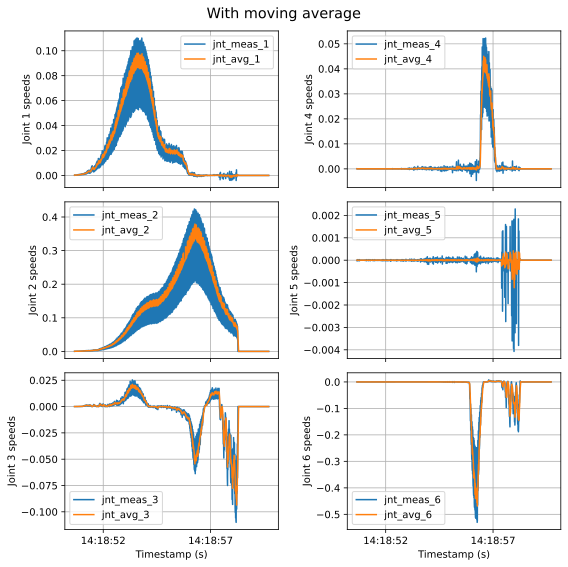
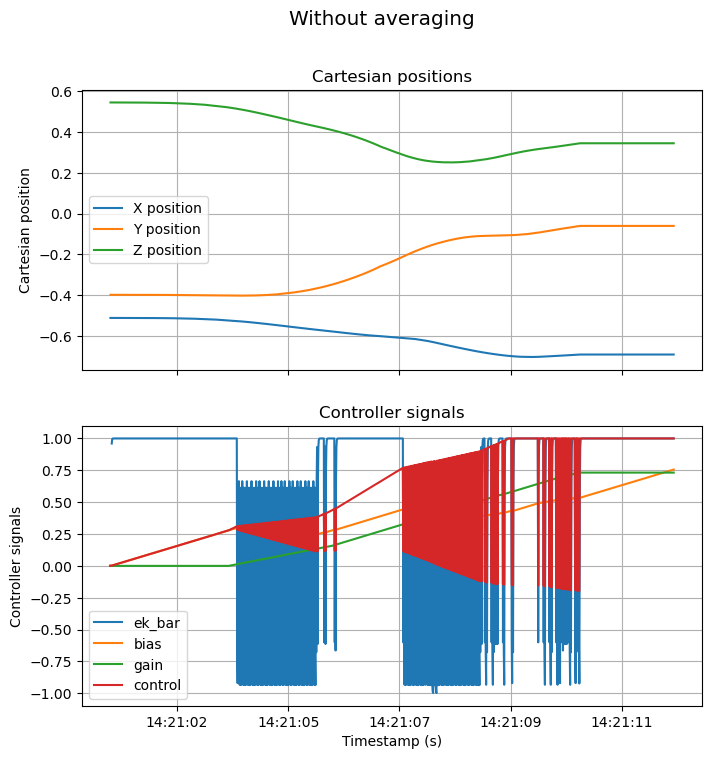
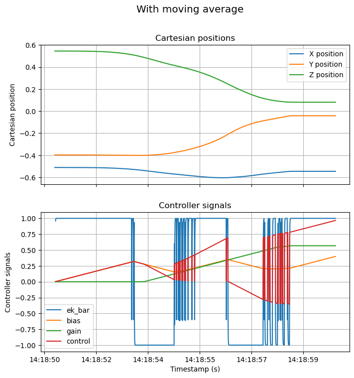
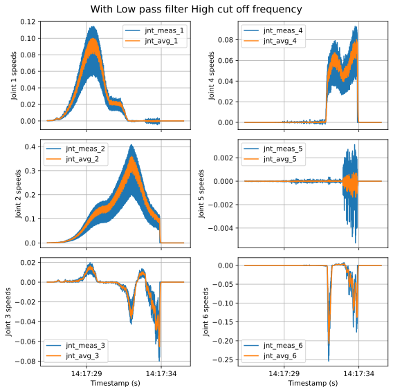
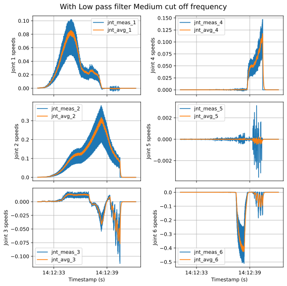
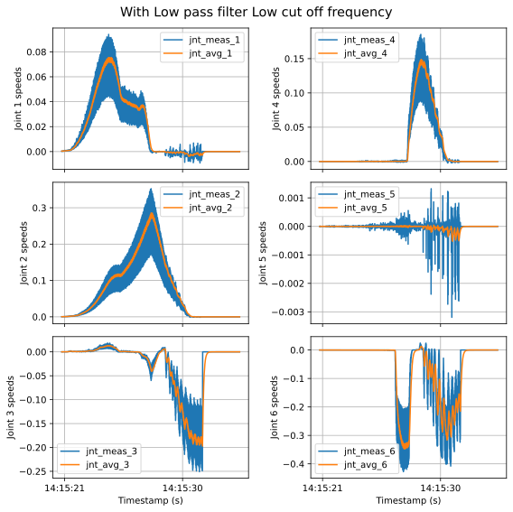
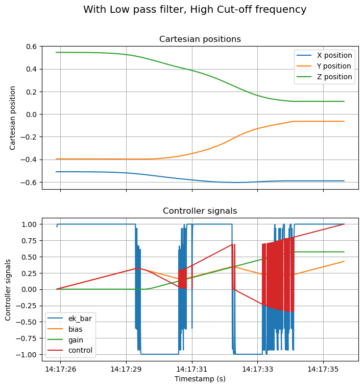
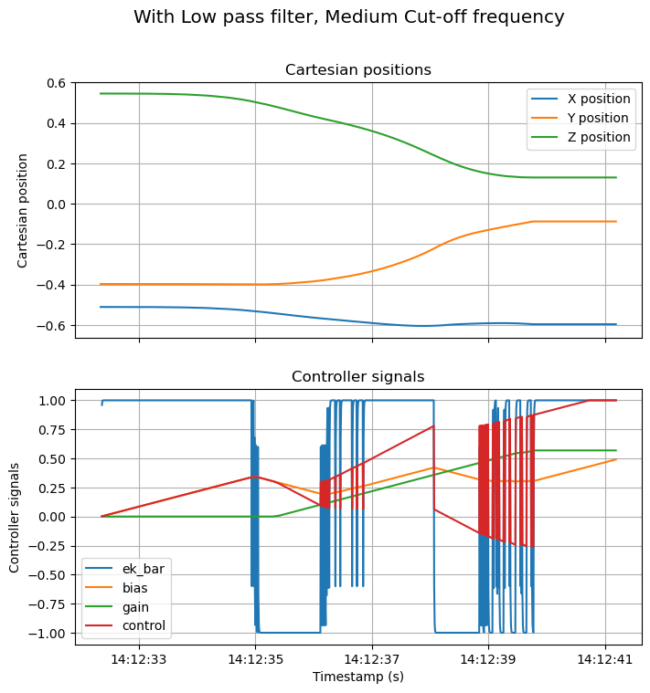
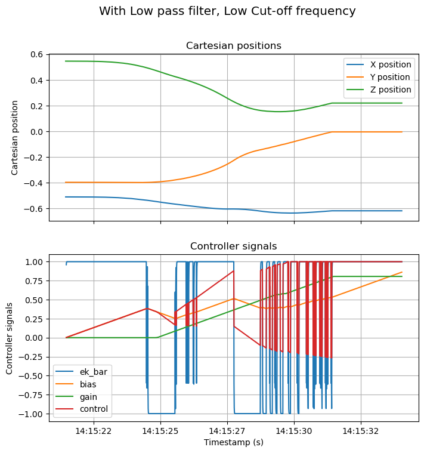

# ARCS

## Project Goal

See docs/project_description.md for more details.

The goal is to erase characters off of a whiteboard using a bimanual robot arm system. This involves the following "skills":

1. Classify a whiteboard as clean or dirty.
2. Identify dirty areas of the whiteboard that require cleaning.
3. Grasp the whiteboard with a free arm so that it will not move while erasing.
4. Move a cleaning tool (eraser) along the surface of the whiteboard to clean dirty regions with the other arm.
5. Check whether the attempted erasing action was successful.

The followoing is a description of what has been implemented thus far.

# Architecture of Activities


This figure is a layout of the **currently implemented** activity architecture in the iiwase project. The headers of the objects provide the activity name, as well as the thread time for the activity. The rows below the header provide important variables which are present in each activity. The arrows indicate a "modifies" relation, where the value of a variable in one activity is copied to the destination variable in a different activity. Provided below is a high level description of the activities used, and their respective responsibilities. 

## perception

- inform when the whiteboard has been detected
- return detected whiteboard vertices 
- return dirty areas vertices


## iiwa_activity
- real time communication with the KUKA FRI and Sunrise workbench.
- determines the cmd mode (Position, JntTorque, or Wrench).
- Provides reading of the sensor data and communication of actuation commands back to the iiwa. 

## iiwa_estimation
- filtering of noisy joint position encoder readings to estimate the state of the robot (real joint positions, joint velocities)
- differentiates the joint positions to obtain joint velocities. This involves measuring it's own cycle time.
- Performs forward kinematics to determine the cartesian positions and velocities of the robot. 

## navigation
- responsible for specifying the type motion that the arm should conduct.
- The motion is specified by a heading vector (in the base frame) which is a direction that the arm must move in, and a velocity magnitude which it should be moving.
- the navigation activity is the interface with the perception activity which sends positions where the arm should be heading in order to accomplish this task. 

## iiwa_controller
- Sends wrench commands to the iiwa activity in order to achieve the desired heading and velocity magnitude. 
- Implements a thresholded adaptive controller (ABAG) to ensure that force applied at end effector is always "human safe" and only applies force in the necessary direction for the task. 

# Perception

With perception, we want to detect the whiteboard and the dirty areas on the whiteboard.

To do so, we use a usb webcam that we put on a fixed location, looking from the top. 

Different methods were considered when developping our perception solution. At the end, we decided to go for a region growing algorithm with several post processing steps. A general overview of the process is depicted at the figure below. We make the assumptions that whiteboard, compared to the other objects in the image, is the *biggest*, relatively *uniformly* colored rectangle. 


Let's go over each of these block:

**PREPROCESS**

In this step, we convert the image in the hsv space. Moreover, we initialize several seeds for the GROW REGION step. We use 3 seeds, distributed accros the middle line of the image.

**GROW REGION**

In this step, starting from a seed, we incrimentally grow a region. The principle is as follow, in pseudo-code:

```python

initial_point = seed
for each point:
  [left,right,up,down] = find_neighbours(point)
  for i in [left,right,up,down]:
    check_if_not_visited()
    if difference_in_hue(i,point) < tolerance:
      add_to_region(i)


```

After this step. we obtain a region where white pixels correspond to the whiteboard, as represented in the figure above.

**EXTERNAL CONTOURS**

After obtaining the region, we want to detect the location of the whiteboard. For this, we follow the following steps:

- find contours of the detected region
- find the contour with the largest area
- approximate this with a polygone 

**CHECK**

After, we do several check to see if the found polygone is coherent with the shape we are looking for. 

- We verify if the aspect ratio of the polygone correspond to the desired shape
- We verify if the angles are close to 90 degrees

**SELECT**

The previous steps were performed for several seeds. In this step, we select the seed that has the smallest epsilon (smaller epsilon correspond to region more similar to the polygon we want to use to approximate the region) and is coherent with our area threshold.

**INTERNAL CONTOURS**

Finally, we find the internal contours of the detected region


## Demo


# Control 

## Implementation Details

### Force Based Cartesian Velocity Control (Free Space Motion)

- Our task is to erase a whiteboard, which involves moving an erasing tool over a flat surface, while exerting some normal force and remaining in contact with that surface. Therefore, we decided that force control was a requirement for our task. 
- KUKA FRI does not allow "switching" control modes (ie between position and force control) online, so we decided to implement a cartesian velocity controller to **move in free space** with force control mode. 
- We could have used the available "impedance control" mode available through the KUKA FRI (equation below). This would involve setting a stiffness k and just moving the point $x_{msr}$ around in free space. This would be a far easier approach. However, it has the following disadvantages:
  - The 'error' term is position based, so the joint torques are proportional to the deviation from a desired trajectory, or time sequences of positions in free space. We did not feel like this was a good fit for our application, since we don't care how the arm approaches the whiteboard, therefore, we did not want to specify an explicit trajectory.
  - There could be safety issues depending on how far we deviate from our desired trajectory, since the control input increases proportionally. Therefore, unforeseen deviations, such as an obstacle, would result in large forces applied to the end effector. 
  - There is no control on the velocity apart from the trajectory specification. Therefore, if the arm is perturbed from the desired trajectory, the control law will exert large joint torques causing it to accelerate until $(x_{FRI} - x_{msr})=0$. Therefore, the resulting velocity of the arm could be much higher than the desired velocity of the trajectory, leading to more safety issues.
  - Overall, the above issues fall under the category of "adding energy to the system proportional to the error", which we did not feel was appropriate for our application. 

$$\tau_{cmd} = J^T[k_c(x_{FRI}-x_{msr}) + W_{FRI}] + D(d_c) + f_{dynamics}(q, \dot{q}, \ddot{q})$$

- We decided instead to eliminate the stiffness term by setting $x_{msr}$ to $x_{FRI}$ and implement a controller that would set $W_{FRI}$ based on the velocity measurement. This controller has the following advantages:
  - It can be made inherently safe by saturating the $W$ term ensuring that the force applied to the end effector is never greater than a maximum value.
  - Any control law can be chosen for $W$, not one that is position dependent, meaning that there is no penalization (or extra control effort) exerted for large deviations from the trajectory, in the case of hitting unforseen obstacles for example. 
  - Instead of **implicitly** controlling the force through a stiffness and a displacement, we are **explicitly** controlling a force to the end effector to move. 

### ABAG Velocity Control

- For velocity control, we use the control law outlined in [1]. We use it for the following reasons:
  - the output is inherently saturated, meaning that we have a bounded force that can be applied at the end effector
  - the gain (analogous to a proportional term) and the bias (analogous to the integral term) are adaptive, and 'tuned' by the controller itself depending on the current state of the system to provide the desired motion specification. 

```c++
void abag(abag_params_t *params, abag_state_t *state, double setpoint, double val){
	state->ek_bar = params->alpha * state->ek_bar + (1 - params->alpha) * sgn(setpoint - val);
	state->bias = saturate(state->bias + 
	    params->delta_bias * hside(fabs(state->ek_bar)-params->bias_thresh) * sgn(state->ek_bar-params->bias_thresh), 
		params->sat_low, params->sat_high);
	state->gain = saturate(state->gain + 
	    params->delta_gain * sgn(fabs(state->ek_bar) - params->gain_thresh), 
		params->sat_low, params->sat_high);
	state->control = saturate(state->bias + state->gain * sgn(setpoint - val), 
	    params->sat_low, params->sat_high);

	return;
}
```
(Above) shows the implementation of the controller outlined in [1]. (Below) shows the values set for the 'hyperparameters' of the controller which determines how the bias and gain terms adapt. Both code blocks from from `iiwa_controller.cpp`.

```cpp
params->max_torque = 2.0;
params->max_force = 5.0;

// Configure ABAG Controller
params->abag_params_cartesian.sat_high = 1;
params->abag_params_cartesian.sat_low = -1;

    // parameters from paper
// TODO we should set alpha to remove the moving avg filter here eventually
// TODO we should do all filtering in the estimation
params->abag_params_cartesian.alpha = 0.75;
params->abag_params_cartesian.bias_thresh = 0.75;
params->abag_params_cartesian.delta_bias = 0.001;
params->abag_params_cartesian.gain_thresh = 0.5;
params->abag_params_cartesian.delta_gain = 0.001;
```

- The 'error' term in the ABAG controller is the difference between the desired velocity and the actual velocity. Below is a code block were we call the abag controller implementation. As can be seen, the abag controller has a state, which is the current set of gains it is using. 

```cpp
abag(&params->abag_params_cartesian, &cts_state->abag_state_x, cts_state->local_velocity_magnitude * cts_state->local_heading[0], local_vel[0]);
```

[1] A. Franchi and A. Mallet, “Adaptive closed-loop speed control of BLDC motors with applications to multi-rotor aerial vehicles,” in 2017 IEEE International Conference on Robotics and Automation (ICRA), May 2017, pp. 5203–5208. doi: 10.1109/ICRA.2017.7989610.

### Two Approaches for Velocity Specification and Control

For the following section, the following symbols apply:
- $\overrightarrow{v_{ee}}$ is the end effector velocity vector, measured from the iiwa.
- $\overrightarrow{h}$ is the heading vector, generated from the state estimation (current position) and the perception (position we want to go towards). $\overrightarrow{h} = x_{des} - x_{ee}$. 
- $v_{des}$ (along with h) is the other part of the motion specification. It is a scalar magnitude of a velocity that we want to have in free space, travelling in the direction of $\overrightarrow{h}$. 
- $\overrightarrow{F}$ is the force applied, previously called $W$, to the KUKA.
- $u_{ABAG}$ is the output of the ABAG controllers mentioned above.


#### 1. Use a single ABAG controller and only control the velocity components along the heading vector $\overrightarrow{h}$ that you want to be travelling in. 

```math
\Delta v = \|\frac{\overrightarrow{v_{ee}}\cdot\overrightarrow{h}}{\|\overrightarrow{v_{ee}}\|^2}\overrightarrow{h}\| - v_{des}
```
```math
\overrightarrow{F} = F_{max} * u_{ABAG}(\Delta v) * \overrightarrow{h}
```


The controller gets to the goal position, but then does not stop and suddenly deviates from the expected behaviour. 


#### 2. Use an ABAG controller for each component (xyz) of the velocity. 

```math
\Delta v_x = \overrightarrow{v_{ee}}[x] - v_{des}*\overrightarrow{h}[x]
```
```math
\Delta v_y = \overrightarrow{v_{ee}}[y] - v_{des}*\overrightarrow{h}[y]
```
```math
\Delta v_z = \overrightarrow{v_{ee}}[z] - v_{des}*\overrightarrow{h}[z]
```
```math
\overrightarrow{F}[x] = F_{max} * u_{ABAG}(\Delta v_x) * \overrightarrow{h}[x]
```
```math
\overrightarrow{F}[y] = F_{max} * u_{ABAG}(\Delta v_y) * \overrightarrow{h}[y]
```
```math
\overrightarrow{F}[z] = F_{max} * u_{ABAG}(\Delta v_z) * \overrightarrow{h}[z]
```

### Velocity Estimation (Filtering)

As explained earlier, we control the motion of the robot by applying a wrench at the end-effector computed from an error in velocity.
To obtain the cartesian velocity, we first differentiate the joint position measured by the encoder to get the joint velocity and we then use forward kinematics to obtain the cartesian velocity. 

As can be observed in the figure below, the joint velocity obtained after differentiation is very noisy. 

We explain this observation from the fact that we use the time we use to differentiate the joint position is probably not synchronised with the time at which the measurements were actually recorded. To improve this, we should assign a timestamp with each encoder reading to use an accurate Delta T.


The signal in yellow is a post-processed averging of the real signal. 
The green signal is the high-frequency component of the joint velocity (real signal - average signal). The distribution of its values is given hereafter:


This distribution is not gaussian and we therefore concluded that we should not use a Kalman Filter to approximate the joint velocity from the noisy signal.

We investigated different filtering methods to cope with the noisy behavior of the estimated joint velocity.

The first method is a simple moving average, the average joint velocity is computed as the mean of the n last estimated joint velocities. This requires to keep track of those in a buffer of size n.

$$\dot{q}_{avg} = \sum_{i=1}^{n} \frac{\dot{q}_{est,i}}{n}$$

The resulting velocity is shown in the next figure for the first 6 joints:



It can be observed that the noise is significantly reduced. We did not tune the size of the averaging buffer.

The most interesting observation is how it reduced the jittering effect on the control signals. 
Hereafter is the control signals when the raw joint velocity estimation is directly used:



The signal ekbar corresponds to the difference between the measured velocity and the desired velocity. The control wrench is then proportional to this integrated error through the gain. Having a nosiy ek_bar gives a vibrating behavior to the robot (to be avoided of course).

In comparison, the next figure shows the same signals when the ek_bar is computed with the moving average estimation. The noise is already reduced.



The other solution we propose to smooth the joint velocity estimation is to use a first order low pass filter. The average velocity is computed as: 
$$\dot{q}_{avg}[k] = (1-\alpha) \dot{q}_{avg}[k-1] + \alpha \dot{q}_{meas}[k]$$
where $\alpha = \dfrac{h}{h+\tau_f}$ with $h$ being the cycle time and $\tau_f$, the time constant of the filter. 
The next figures show the averaged joint velocities when using a high ($\tau_f = 2h$), middle ($\tau_f = 5h$) and low ($\tau_f = 10h$) cut-off frequency in the filter.







The corresponding control signals are:




The control command was the least noisy with the low pass filter with the lower cut-off frquency (neglect the oscillations around 14:15:30, the robot had a problem).

## Future Implementation (TODO)
- tune the controller
- orientation control with another ABAG
- orientation of the entire robot arm to avoid singularities and position better to sense forces

## iiwa_activity changes
1. Allow us to set the position of the virtual spring directly in stiffness control mode, rather than sending the velocity. 
2. Give us a timestamp of the encoder measurements from the iiwa, so that the time corresponds to when the actual measurement is made. This will allow us to accurately measure velocity. 
