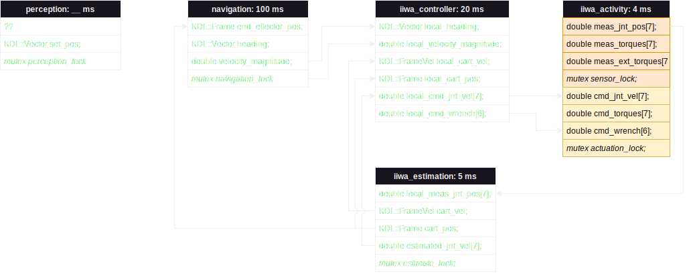

# ARCS

## Project Goal

See docs/project_description.md for more details.

The goal is to erase characters off of a whiteboard using a bimanual robot arm system. This involves the following "skills":

1. Classify a whiteboard as clean or dirty.
2. Identify dirty areas of the whiteboard that require cleaning.
3. Grasp the whiteboard with a free arm so that it will not move while erasing.
4. Move a cleaning tool (eraser) along the surface of the whiteboard to clean dirty regions with the other arm.
5. Check whether the attempted erasing action was successful.

The followoing is a description of what has been implemented thus far.

# Architecture of Activities

This figure is a layout of the **currently implemented** activity architecture in the iiwase project. The headers of the objects provide the activity name, as well as the thread time for the activity. The rows below the header provide important variables which are present in each activity. The arrows indicate a "modifies" relation, where the value of a variable in one activity is copied to the destination variable in a different activity. Provided below is a high level description of the activities used, and their respective responsibilities. 

## perception
TODO...

## iiwa_activity
- real time communication with the KUKA FRI and Sunrise workbench.
- determines the cmd mode (Position, JntTorque, or Wrench).
- Provides reading of the sensor data and communication of actuation commands back to the iiwa. 

## iiwa_estimation
- filtering of noisy joint position encoder readings to estimate the state of the robot (real joint positions, joint velocities)
- differentiates the joint positions to obtain joint velocities. This involves measuring it's own cycle time.
- Performs forward kinematics to determine the cartesian positions and velocities of the robot. 

## navigation
- responsible for specifying the type motion that the arm should conduct.
- The motion is specified by a heading vector (in the base frame) which is a direction that the arm must move in, and a velocity magnitude which it should be moving.
- the navigation activity is the interface with the perception activity which sends positions where the arm should be heading in order to accomplish this task. 

## iiwa_controller
- Sends wrench commands to the iiwa activity in order to achieve the desired heading and velocity magnitude. 
- Implements a thresholded adaptive controller (ABAG) to ensure that force applied at end effector is always "human safe" and only applies force in the necessary direction for the task. 

# Perception
TODO

# Control 

## Implementation Details

Key attributes to explain "why?":
1. Force Based Cartesian Velocity Control
  - why don't we use position or velocity control?
  - why is velocity the best choice for deriving an error signal and closing the loop?
2. ABAG control law on determining the force to apply at the end effector
  - why not use PID
  - why use 2 ABAG controllers (1 for position, 1 for orientation) instead of 6 (1 for each DoF)

### Velocity Estimation (Filtering)
  - why do we need filtering?
  - what type of filter do we choose and why?

Some comments about this graph here...

Some comments about this other graph...**DO NOT USE A KALMAN FILTER FOR VELOCITY ESTIMATION**

## Future Implementation (TODO)
- orientation control with another ABAG
- orientation of the entire robot arm to avoid singularities and position better to sense forces
