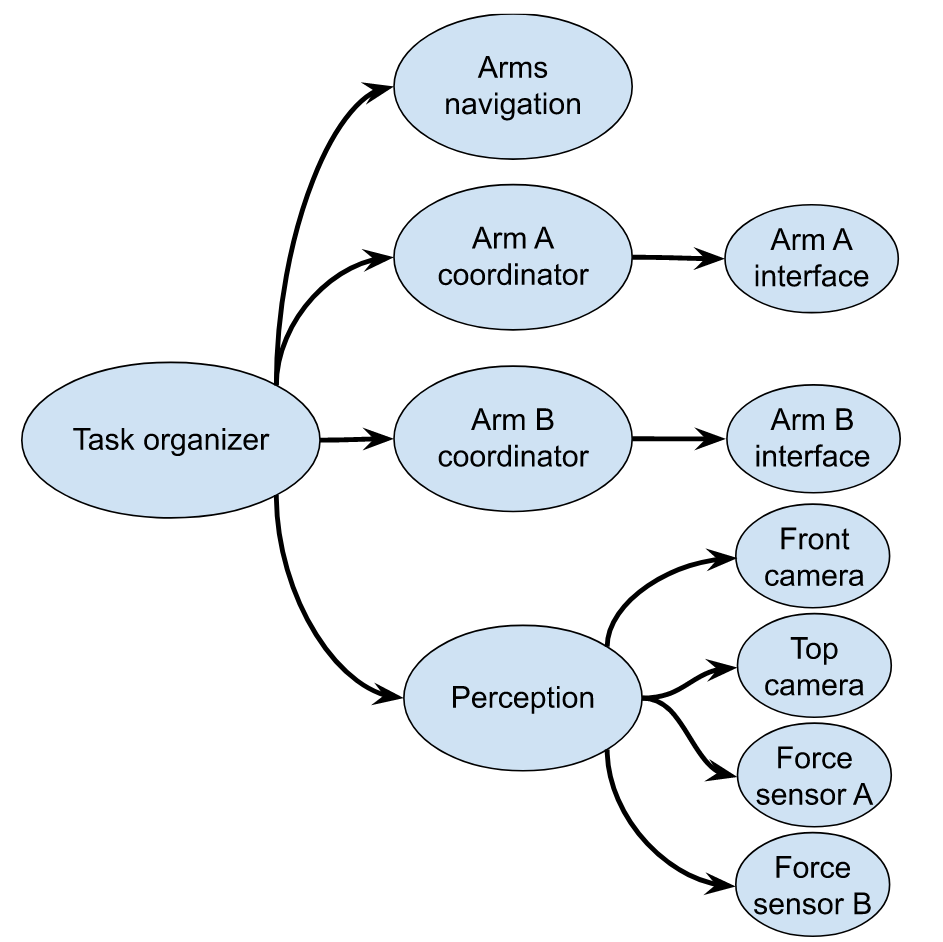
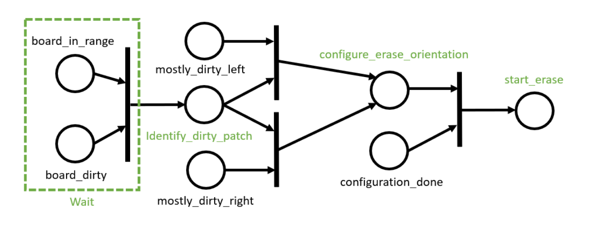
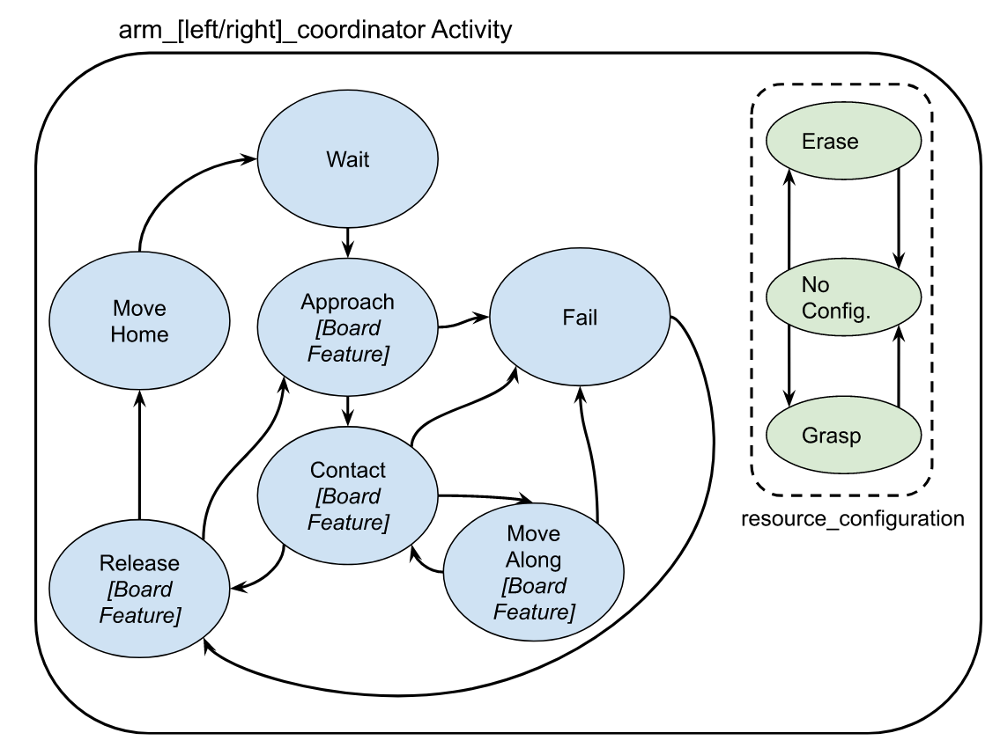
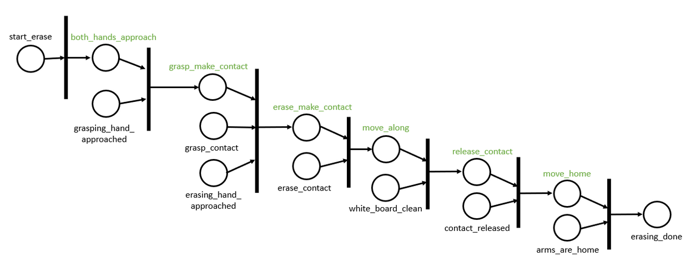
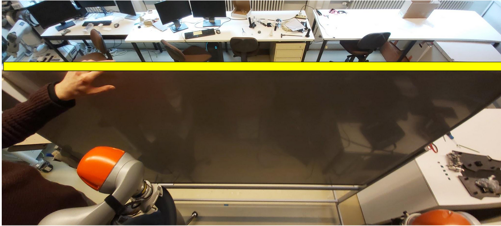
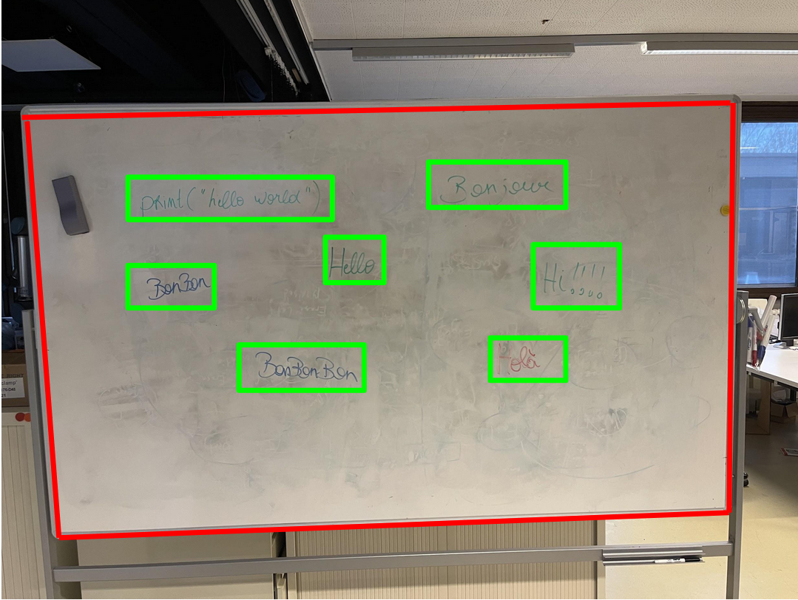
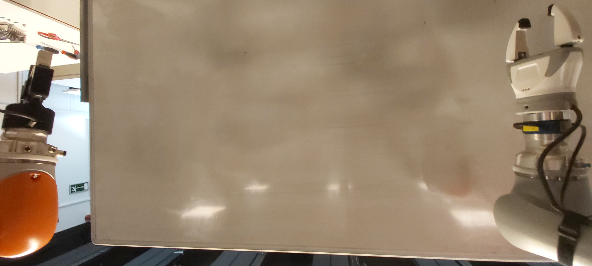

# Problem Description 

**Brendan Pousett, Deniz Soysal, Louis Hanut, Miguel Lejeune**

Team iiwaSE seeks to implement a “whiteboard manipulation and erasing” skill on a bimanual robot arm system. While erasing and moving rolling whiteboards is not necessarily an industrially relevant problem, the skill required is similar to the problem on concrete surface finishing, as required in EU based RobetArme project. 

In the process of concrete surface finishing, where the concrete was deposited by the shotcrete process, the worker utilises bimanual manipulation to move a stiff, serrated board across the surface of the concrete, removing excess material.

# Product Description

## MVP Scope

1. Classify a whiteboard as clean or dirty.
2. Identify dirty areas of the whiteboard that require cleaning.
3. Grasp a normally oriented, wheeled whiteboard on the top edge with one arm above the dirty region.
4. Move a cleaning tool (eraser) along the surface of the whiteboard to clean dirty regions with the other arm.
5. Check whether the attempted erasing action was successful.

## Controlled Conditions

1. The whiteboard plane will be orthogonal to the symmetry plane of the bimanual system.
2. The dirty areas of the whiteboard will be in the workspace of the robot.
3. The entire set of dirty regions on the whiteboard always need to be erased at one time.
4. The whiteboard will not have any additional objects on the writing surface, such as magnets, tape, etc.
5. The whiteboard will not be manipulated by external sources during the erasing phase.
6. Humans will not be present in the workspace during the erasing phase. 

## Possible Future Work

1. Allow the board to be skewed, or only partially in the workspace and require the system to manipulate it to a suitable orientation for cleaning (remove conditions 1&2 above).
2. Add intelligent cleaning functionality, where the user might want the robot to erase certain colours, or correct spelling mistakes (remove condition 3).
3. Add the ability to distinguish writing from fixed objects on the whiteboard, such as post it notes, magnets, other erasers, tape, etc. (remove condition 4). 
4. Add ability to continue erasing even if the whiteboard surface is moved by external agents during the erasing phase (remove condition 5). 
5. Add ability to interact with humans, involving pausing when a human enters the workspace, reorient board if human skewed it, and resume erasing operation when human has left (remove condition 6). 

# Architecture of Activities

## Activity Architecture

## iiwaSE_activity

### Petri Net (TODO update for Select Dirty Patch)

### State Description Table (TODO update for Select Dirty Patch -> Miguel):

|            State            	|                Coordinator Activities (state)                	|                     Source Flags Set in State                    	|                                                                                                                                        Description                                                                                                                                        	|   	|
|:---------------------------:	|:------------------------------------------------------------:	|:----------------------------------------------------------------:	|:-----------------------------------------------------------------------------------------------------------------------------------------------------------------------------------------------------------------------------------------------------------------------------------------:	|---	|
| Wait                        	| perception (todo which state?)                               	| board_in_range                                                   	| If whiteboard (todo insert feature here) is present within the workspace of the arms, then set this flag.  todo notes on implementation                                                                                                                                                	|   	|
|                             	| perception (todo which state?)                               	| board_dirty                                                      	| If (todo whiteboard feature) contains non white marked regions, set this flag.                                                                                                                                                                                                            	|   	|
| Identify Dirty Patch        	| perception todo which state                                  	| mostly_dirty_left OR mostly_dirty_right                          	| Compute the most prominent dirty region on the whiteboard surface feature and set the flag corresponding to the most dirty region.                                                                                                                                                        	|   	|
| Configure Erase Orientation 	| arm_left_coordinator (wait) AND arm_right_coordinator (wait) 	| configuration_done                                               	| If the mostly_dirty_left flag is set, then set the arm_left_coordinator resource to Erase, and the arm_right_coordinator resource to Grasp. If the mostly_dirty_right flag is set, do the opposite.  Once the configuration of each arm is set, then set the configuration_done flag.  	|   	|
| Erase                       	|                                                              	| Condition to be checked from the arm coordinators? + clean flag? 	| Sets the Arms coordinator activities into RUNNING STATE (to be checked?)                                                                                                                                                                                                                  	|   	|

## arm_left/right_coordinator Activity (Todo split into two separate coordinator state machines for erasing and grasping)

### Petri Net

### State Description Table (for Erasing Configuration):

|      State      	|            Sub-Activities Running (state)            	| State Transition Flags 	|                                                                                             Description                                                                                             	|   	|
|:---------------:	|:----------------------------------------------------:	|:----------------------:	|:---------------------------------------------------------------------------------------------------------------------------------------------------------------------------------------------------:	|---	|
| Wait            	| arm_navigation                                       	|                        	|                                                                                                                                                                                                     	|   	|
|                 	| arm_left/right_interface                           	|                        	|                                                                                                                                                                                                     	|   	|
| Approach        	| arm_navigation arm_left/right_interface perception 	| approach_reached       	| In this state, the end effector is guided to an approach location computed beforehand. The speed of motion can be high (relatively).  Perception is used for feedback on position.                  	|   	|
| Contact         	| arm_navigation arm_left/right_interface perception 	| contact                	| Same as the previous state but slower. The wrench at the end-effector now comprises a component for the applied force/torque.  The contact is detected from the reaction force at the end effector. 	|   	|
| Move along      	| arm_navigation arm_left/right_interface perception 	| white_board_clean      	| Follow a trajectory (Raster e.g.) to cover the patch defined around the marking.                                                                                                                    	|   	|
| Release contact 	| arm_navigation arm_left/right_interface perception 	| contact_released       	| Break contact with the board (“go back to  approach location”)                                                                                                                                      	|   	|

### State Description Table (for Grasping Configuration)

TODO

## Perception state machine 

### State Transition Diagram

TODO

### State Description Table

TODO

# World Model for the MVP

## Top View Features

|     Object Feature     	| Representation 	|                                                          Characteristics                                                         	|
|:----------------------:	|:--------------:	|:--------------------------------------------------------------------------------------------------------------------------------:	|
| whiteboard_top_edge    	| line of pixels 	| Longer than specified minimum, contrast with region below it (colour boundary)                                                   	|
| left_arm_end_effector  	| point          	| colour (by placing identifiable mark on end effector) or shape (convolving image with kernel representing shape of end-effector) 	|
| right_arm_end_effector 	| point          	| colour (by placing identifiable mark on end effector) or shape (convolving image with kernel representing shape of end-effector) 	|

## Front View Features

|          Object Feature          	|       Representation       	|                                                                      Characteristics                                                                     	|
|:--------------------------------:	|:--------------------------:	|:--------------------------------------------------------------------------------------------------------------------------------------------------------:	|
| whiteboard_boundaries            	| Quadrilateral              	| Larger than specified minimum, contrast with region below it (colour boundary) Colour                                                                    	|
| word_boundaries                  	| Quadrilateral or rectangle 	| colour (by using colour histogram and comparing to dominant colour of whiteboard) or shape (convolving image with kernel - SoA to detect words on image) 	|
| left_arm_end_effector - eraser   	| point                      	| Similar to top view                                                                                                                                      	|
| right_arm_end_effector - grasper 	| point                      	| Similar to top view                                                                                                                                      	|

## Raw Images

